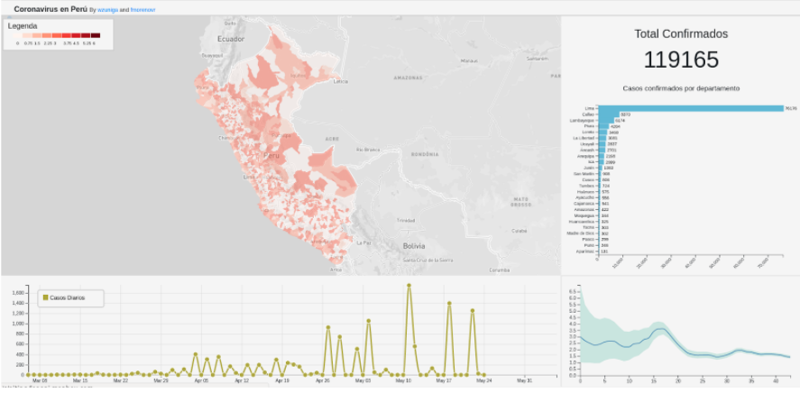

# CoronaVis

A website to visualize the behavior of Corona Virus.

## Install node and npm

In the project directory, you can run:

    sudo apt update
    sudo apt -y install curl dirmngr apt-transport-https lsb-release ca-certificates
    curl -sL https://deb.nodesource.com/setup_12.x | sudo -E bash -
    sudo apt -y install nodejs

## Depedencies

Go to the root path directory of this project:

    npm install

## Run the project

Just type in console:

    npm start

